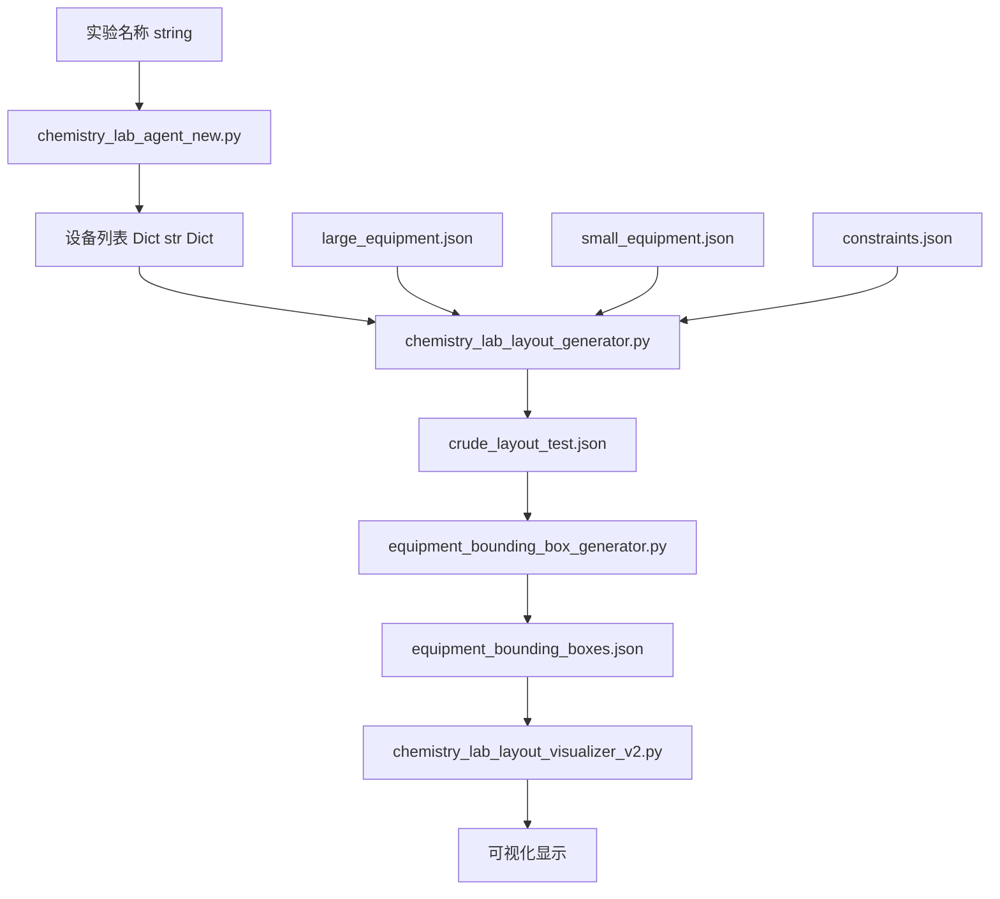

# Chemistry Lab Layout Generator

这是一个用于生成化学实验室布局的工具集，包含以下功能：
- 基于实验需求生成设备清单
- 根据空间约束生成实验室布局
- 将布局转换为2D图像（蓝图风格和真实感风格）

## 系统架构和数据流



## 主要组件说明

### 生成器组件

1. `chemistry_lab_agent_new.py`（设备清单生成器）
   - **输入**：实验名称（如"crude salt purification"）
   - **输出**：分类的设备清单（大型固定设备和小型可移动设备）
   - **功能**：根据实验需求自动生成所需设备列表

2. `chemistry_lab_layout_generator.py`（布局生成器）
   - **输入**：设备清单、约束条件
   - **输出**：JSON 格式的布局方案
   - **功能**：考虑空间约束和安全要求，生成优化的布局

### 验证与可视化组件

3. `equipment_bounding_box_generator.py`（边界框生成器）
   - **输入**：布局方案和设备规格
   - **输出**：精确的边界框数据
   - **功能**：计算每个设备的实际占用空间，验证空间约束

4. `chemistry_lab_layout_visualizer_v2.py`（可视化工具）
   - **输入**：布局方案（JSON）
   - **输出**：直观的 2D 布局图
   - **功能**：可视化展示布局方案，突出显示潜在问题

### 数据文件

5. 配置文件
   - `large_equipment.json`：大型固定设备的规格数据
   - `small_equipment.json`：小型可移动设备的规格数据
   - `constraints.json`：布局约束和安全要求

6. 中间文件
   - `crude_layout_test.json`：生成的布局方案（包含坐标和方向）
   - `equipment_bounding_boxes.json`：计算后的边界框数据

## 主要组件说明

### 核心Python文件
- `chemistry_lab_agent_new.py`: 设备清单生成器
  - 输入：实验名称
  - 输出：大型和小型设备清单
  - 功能：使用 AI 模型生成实验所需设备

- `chemistry_lab_layout_generator.py`: 布局生成器
  - 输入：设备清单和约束条件
  - 输出：布局方案（JSON格式）
  - 功能：生成符合安全规范的布局

- `equipment_bounding_box_generator.py`: 边界框生成器
  - 输入：布局JSON和设备规格
  - 输出：精确的边界框数据
  - 功能：计算设备占用空间和验证布局

- `chemistry_lab_layout_visualizer_v2.py`: 可视化工具
  - 输入：布局JSON
  - 输出：直观的布局图像
  - 功能：可视化布局方案和潜在问题

### 关键数据文件
- `large_equipment.json`: 大型固定设备配置
- `small_equipment.json`: 小型可移动设备配置
- `crude_layout_test.json`: 生成的布局方案
- `equipment_bounding_boxes.json`: 边界框计算结果

## 环境配置

1. 创建并激活虚拟环境：

```bash
python -m venv .venv
source .venv/bin/activate  # Linux/Mac
# 或
.venv\Scripts\activate  # Windows
```

1. 安装依赖：

```bash
pip install -r requirements.txt
```

1. 配置API密钥：

```bash
# Linux/Mac
export DASHSCOPE_API_KEY="你的DashScope API密钥"

# Windows (CMD)
set DASHSCOPE_API_KEY=你的DashScope API密钥

# Windows (PowerShell)
$env:DASHSCOPE_API_KEY="你的DashScope API密钥"
```

## 使用示例

1. 生成实验室布局：

```bash
python chemistry_lab_layout_generator.py \
  --large-equipment-file large_equipment.json \
  --experiment "crude salt purification" \
  --constraints "Fume hood in upper-right corner; sink on north wall; main door on south wall"
```

1. 将布局转换为图像：

```bash
python chemistry_lab_layout_to_image.py
```

## 注意事项

- 确保已正确设置 API 密钥环境变量
- 建议使用 Python 3.8 或更高版本
- 所有路径输入支持相对路径和绝对路径
